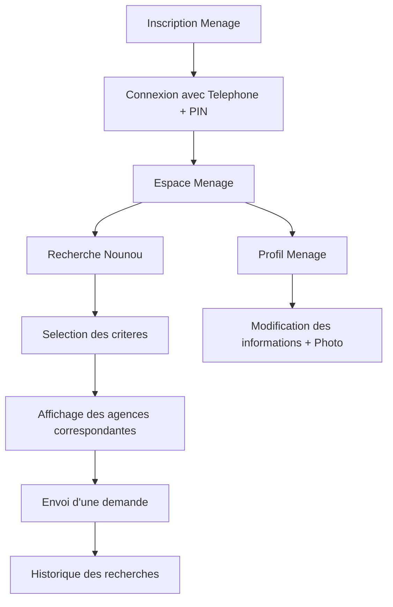
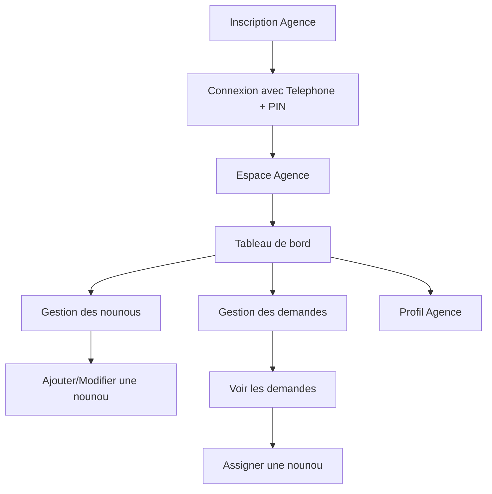
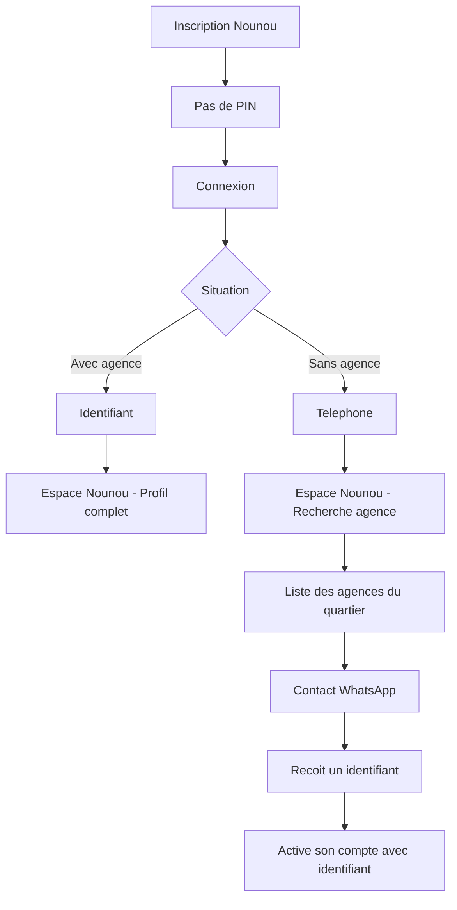
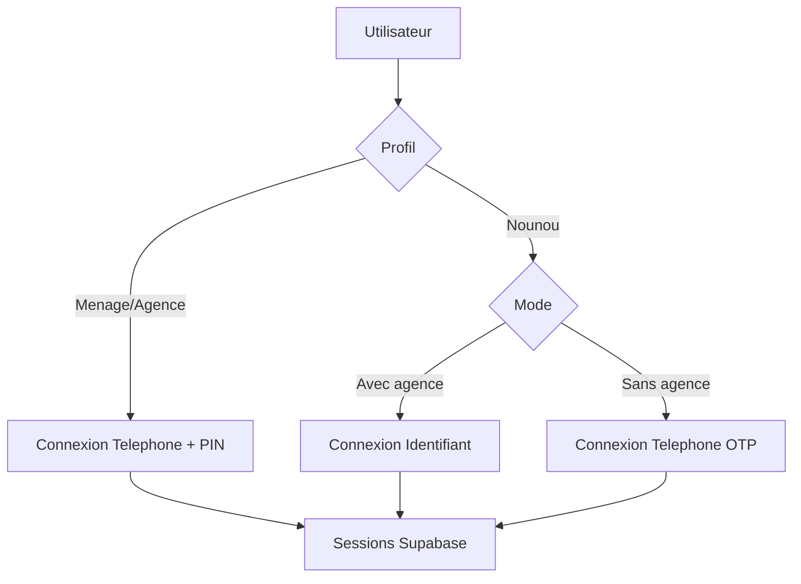

# Nounou Connect - Guide d'adaptation Backend

**Version** : Phase 2 - Parcours complet (Menage, Agence, Nounou)

---

## Table des matieres

1. [Introduction](#introduction)
2. [Vue d'ensemble du projet](#vue-densemble-du-projet)
3. [Structure de la base de donnees](#structure-de-la-base-de-donnees)
4. [Parcours utilisateurs](#parcours-utilisateurs)
5. [Fonctionnalites detaillees](#fonctionnalites-detaillees)
6. [RLS et securite](#rls-et-securite)
7. [Fonctions RPC](#fonctions-rpc)
8. [Storage (photos)](#storage-photos)
9. [Migration SQL complete](#migration-sql-complete)
10. [Tests et verification](#tests-et-verification)
11. [Bonnes pratiques](#bonnes-pratiques)
12. [Recapitulatif des modifications backend](#recapitulatif-des-modifications-backend)

---

## Introduction

### Contexte du projet

Nounou Connect est une plateforme de mise en relation entre familles (menages), agences de placement et nounous professionnelles en Cote d'Ivoire.

Le projet a ete developpe en deux phases :

- **Phase 1** : creation du backend (base de donnees, RLS, fonctions, etc.)
- **Phase 2** : adaptation du frontend et correction des parcours utilisateurs

Ce document est le guide d'adaptation backend pour l'equipe qui reprend le projet. Il explique ce qui a ete modifie, pourquoi, et comment s'orienter pour finaliser l'integration.

---

## Vue d'ensemble du projet

### Architecture technique

| Couche | Technologie |
|---|---|
| Frontend | React 19, TypeScript, Vite |
| Backend | Supabase (PostgreSQL + Auth + Storage) |
| Etat | Zustand + TanStack Query |
| PWA | Vite PWA Plugin (Service Worker) |

### Structure des dossiers frontend

```
src/
├── pages/
│   ├── EspaceMenage.tsx         # Tableau de bord Menage
│   ├── EspaceAgence.tsx         # Tableau de bord Agence
│   ├── EspaceNounou.tsx         # Tableau de bord Nounou
│   ├── DemandeAgence.tsx        # Gestion des demandes (Agence)
│   ├── GestionNounous.tsx       # Gestion du vivier (Agence)
│   ├── ProfilPage.tsx           # Profil Menage
│   ├── ProfilAgence.tsx         # Profil Agence
│   ├── RechercheNounou.tsx      # Recherche de nounou
│   ├── InscriptionPage.tsx      # Inscription
│   ├── ConnexionPage.tsx        # Connexion
│   └── ...
├── hooks/
│   ├── useAuth.ts               # Authentification (connecte a Supabase)
│   ├── useMenage.ts             # Profil Menage
│   ├── useAgence.ts             # Profil Agence
│   └── ...
├── store/
│   └── useAuthStore.ts          # Etat global (Zustand)
├── lib/
│   ├── supabase.ts              # Client Supabase
│   ├── pin.ts                   # Transformation PIN vers Password
│   ├── phone.ts                 # Normalisation telephone
│   ├── profiles.ts              # Build des profils
│   └── errorHandler.ts          # Gestion des erreurs
└── styles/
    └── index.css                # Styles globaux
```

---

## Structure de la base de donnees

### Schema complet (0001_schema.sql)

```sql
-- ============================================================
-- 1. MENAGES (Familles)
-- ============================================================
CREATE TABLE menages (
  id          UUID PRIMARY KEY DEFAULT gen_random_uuid(),
  user_id     UUID NOT NULL REFERENCES auth.users(id) ON DELETE CASCADE,
  nom         TEXT NOT NULL,
  telephone   TEXT NOT NULL,
  quartier    TEXT NOT NULL,
  photo_url   TEXT,                    -- NOUVEAU : Photo de profil
  email       TEXT,                    -- NOUVEAU : Email optionnel
  created_at  TIMESTAMPTZ NOT NULL DEFAULT now(),
  UNIQUE (user_id)
);

-- ============================================================
-- 2. AGENCES
-- ============================================================
CREATE TABLE agences (
  id            UUID PRIMARY KEY DEFAULT gen_random_uuid(),
  user_id       UUID NOT NULL REFERENCES auth.users(id) ON DELETE CASCADE,
  nom           TEXT NOT NULL,
  telephone     TEXT NOT NULL,
  quartier      TEXT NOT NULL,
  description   TEXT,
  photo_url     TEXT,
  email         TEXT,                    -- NOUVEAU : Email optionnel
  note_moyenne  NUMERIC(2,1) NOT NULL DEFAULT 0,
  created_at    TIMESTAMPTZ NOT NULL DEFAULT now(),
  UNIQUE (user_id)
);

-- ============================================================
-- 3. NOUNOUS
-- ============================================================
CREATE TABLE nounous (
  id              UUID PRIMARY KEY DEFAULT gen_random_uuid(),
  agence_id       UUID NOT NULL REFERENCES agences(id) ON DELETE CASCADE,
  user_id         UUID REFERENCES auth.users(id) ON DELETE SET NULL,
  nom             TEXT NOT NULL,
  telephone       TEXT,                    -- Telephone pour rattachement
  identifiant     TEXT,                    -- IDENTIFIANT UNIQUE pour connexion
  quartier        TEXT NOT NULL,
  ethnie          TEXT,                    -- Ethnie (obligatoire a l'inscription)
  experience      TEXT NOT NULL DEFAULT 'Non renseigne',
  tarif           INTEGER NOT NULL DEFAULT 0,
  langues         TEXT[] NOT NULL DEFAULT '{}',
  photo_url       TEXT,
  disponible      BOOLEAN NOT NULL DEFAULT true,
  type_service    TEXT DEFAULT 'Nounou',   -- Type de service
  note_moyenne    NUMERIC(2,1) NOT NULL DEFAULT 0,
  created_at      TIMESTAMPTZ NOT NULL DEFAULT now(),
  UNIQUE (user_id),
  UNIQUE (identifiant),                    -- Identifiant unique
  UNIQUE (telephone) WHERE telephone IS NOT NULL
);

-- ============================================================
-- 4. DEMANDES (Mise en relation)
-- ============================================================
CREATE TABLE demandes (
  id                 UUID PRIMARY KEY DEFAULT gen_random_uuid(),
  agence_id          UUID NOT NULL REFERENCES agences(id) ON DELETE CASCADE,
  menage_id          UUID NOT NULL REFERENCES menages(id) ON DELETE CASCADE,
  nounou_assignee_id UUID REFERENCES nounous(id) ON DELETE SET NULL,
  quartier           TEXT NOT NULL,
  besoin             TEXT NOT NULL,
  temps              TEXT NOT NULL,
  logement           TEXT NOT NULL,
  statut             TEXT NOT NULL DEFAULT 'En attente'
                        CHECK (statut IN ('En attente', 'Assignee')),
  date               TIMESTAMPTZ NOT NULL DEFAULT now()
);

-- ============================================================
-- 5. AVIS (Notation)
-- ============================================================
CREATE TABLE avis (
  id          UUID PRIMARY KEY DEFAULT gen_random_uuid(),
  nounou_id   UUID NOT NULL REFERENCES nounous(id) ON DELETE CASCADE,
  menage_id   UUID NOT NULL REFERENCES menages(id) ON DELETE CASCADE,
  note        INTEGER NOT NULL CHECK (note BETWEEN 1 AND 5),
  commentaire TEXT,
  created_at  TIMESTAMPTZ NOT NULL DEFAULT now()
);

-- ============================================================
-- 6. RECHERCHES (Historique Menage)
-- ============================================================
CREATE TABLE recherches (
  id         UUID PRIMARY KEY DEFAULT gen_random_uuid(),
  menage_id  UUID NOT NULL REFERENCES menages(id) ON DELETE CASCADE,
  quartier   TEXT NOT NULL,
  besoin     TEXT NOT NULL,
  temps      TEXT NOT NULL,
  logement   TEXT NOT NULL,
  date       TIMESTAMPTZ NOT NULL DEFAULT now()
);

-- ============================================================
-- 7. VUES PUBLIQUES
-- ============================================================
-- Vue publique des agences (pour les recherches anonymes)
CREATE OR REPLACE VIEW agences_public AS
SELECT
  a.id,
  a.nom,
  a.telephone,
  a.quartier,
  a.description,
  a.photo_url,
  a.note_moyenne AS note,
  COUNT(DISTINCT n.id) AS "nbNounous",
  COUNT(DISTINCT av.id) AS "nbAvis"
FROM agences a
LEFT JOIN nounous n ON n.agence_id = a.id
LEFT JOIN avis av ON av.nounou_id = n.id
GROUP BY a.id;

-- Vue publique des nounous (sans telephone pour confidentialite)
CREATE OR REPLACE VIEW nounous_public AS
SELECT
  id,
  agence_id,
  nom,
  experience,
  langues,
  tarif,
  quartier,
  photo_url,
  disponible,
  note_moyenne,
  note_moyenne AS note,
  created_at
FROM nounous;
```

---

## Parcours utilisateurs

### Parcours Menage (Famille)



**Etapes detaillees**

| Etape | Action | Champs requis |
|---|---|---|
| Inscription | Creation du compte | Prenom, Nom, Telephone, Quartier, PIN (4 chiffres) |
| Connexion | Authentification | Telephone + PIN |
| Recherche | Trouver une nounou | Quartier, Besoin, Temps, Logement |
| Demande | Envoyer une demande | Les criteres de recherche sont envoyes a l'agence |
| Profil | Modifier ses informations | Nom, Telephone, Quartier, Email, Photo |

### Parcours Agence



**Etapes detaillees**

| Etape | Action | Champs requis |
|---|---|---|
| Inscription | Creation du compte | Nom de l'agence (uniquement), Telephone, Quartier, PIN (4 chiffres) |
| Connexion | Authentification | Telephone + PIN |
| Gestion nounous | Ajouter/Modifier | Nom, Telephone, Quartier, Experience, Tarif, Langues, Photo |
| Assignation | Assigner a une demande | Selectionner une nounou disponible |
| Profil | Modifier | Nom, Telephone, Quartier, Description, Email, Photo |

### Parcours Nounou



**Etapes detaillees**

| Etape | Action | Champs requis |
|---|---|---|
| Inscription | Creation du compte | Pas de PIN, Prenom, Nom, Telephone, Quartier, Ethnie |
| Connexion (avec agence) | Authentification | Identifiant (NC-XXX-XXXX) |
| Connexion (sans agence) | Authentification | Telephone (OTP) |
| Profil sans agence | Consultation + Modification | Nom, Telephone, Quartier, Ethnie, Experience, Tarif, Photo |
| Profil avec agence | Consultation uniquement | Toutes les infos gerees par l'agence |
| Rattachement | Rejoindre une agence | L'agence donne un identifiant, la nounou l'entre |

---

## Fonctionnalites detaillees

### 1. Authentification

**Systeme de PIN**

Le systeme utilise un PIN a 4 chiffres transforme en mot de passe pour Supabase Auth.

```typescript
// lib/pin.ts
const PIN_PASSWORD_PREFIX = "Nc-Pin-V1-";

export function pinToPassword(pin: string): string {
  return `${PIN_PASSWORD_PREFIX}${pin}`;
}
```

**Profils et connexion**

| Profil | Methode de connexion | PIN requis |
|---|---|---|
| Menage | Telephone + PIN | Oui |
| Agence | Telephone + PIN | Oui |
| Nounou (avec agence) | Identifiant | Non |
| Nounou (sans agence) | Telephone (OTP) | Non |

**Schema d'authentification**



**Inscription - detail par profil**

| Profil | Champs | PIN |
|---|---|---|
| Menage | Prenom, Nom, Telephone, Quartier | Oui, 4 chiffres |
| Agence | Nom de l'agence (pas de prenom), Telephone, Quartier, Description (optionnel), Email (optionnel) | Oui, 4 chiffres |
| Nounou | Prenom, Nom, Telephone, Quartier, Ethnie | Non |

**Connexion - detail par profil**

| Profil | Methode |
|---|---|
| Menage | Telephone + PIN |
| Agence | Telephone + PIN |
| Nounou (avec agence) | Identifiant (NC-XXX-XXXX) |
| Nounou (sans agence) | Telephone (OTP) |

### 2. Gestion des profils

**Profil Menage**

```typescript
interface Menage {
  id: string;
  user_id: string;
  nom: string;
  telephone: string;
  quartier: string;
  email?: string;           // NOUVEAU
  photo_url?: string;       // NOUVEAU
  created_at: string;
}
```

Fonctionnalites :
- Consultation des informations
- Modification (Nom, Telephone, Quartier, Email)
- Upload de photo de profil
- Deconnexion

**Profil Agence**

```typescript
interface Agence {
  id: string;
  user_id: string;
  nom: string;              // Nom de l'agence uniquement
  telephone: string;
  quartier: string;
  description?: string;
  email?: string;           // NOUVEAU
  photo_url?: string;
  note_moyenne: number;
  created_at: string;
}
```

Fonctionnalites :
- Consultation des informations
- Modification (Nom, Telephone, Quartier, Description, Email)
- Upload de photo de profil
- Deconnexion

**Profil Nounou - Cas 1 : sans agence**

```typescript
interface Nounou {
  id: string;
  user_id: string;
  agence_id: null;           // Pas d'agence
  nom: string;
  telephone: string;
  quartier: string;
  ethnie: string;            // Obligatoire
  experience: string;
  tarif: number;
  langues: string[];
  photo_url?: string;
  disponible: boolean;
  note_moyenne: number;
}
```

Fonctionnalites :
- Consultation des informations
- Modification (Nom, Telephone, Quartier, Ethnie, Experience, Tarif)
- Upload de photo de profil
- Liste des agences du quartier (scroll horizontal)
- Filtre par commune
- Contact WhatsApp pour rejoindre une agence

**Profil Nounou - Cas 2 : avec agence**

```typescript
interface Nounou {
  id: string;
  user_id: string;
  agence_id: string;         // Rattachee a une agence
  nom: string;
  telephone: string;
  quartier: string;
  ethnie: string;
  experience: string;
  tarif: number;
  langues: string[];
  photo_url?: string;
  disponible: boolean;
  note_moyenne: number;
  agence: {
    id: string;
    nom: string;
    quartier: string;
    telephone: string;
  };
}
```

Fonctionnalites :
- Consultation des informations (lecture seule)
- Message "Contactez votre agence pour modifier"
- Lien WhatsApp vers l'agence avec message prerempli
- Pas de modification directe

### 3. Recherche et mise en relation

**Recherche de nounou (Menage) - etapes du wizard**

| Etape | Champ | Options |
|---|---|---|
| 1 | Quartier | Liste des communes |
| 2 | Besoin | Garde d'enfants / Aide menagere / Mixte |
| 3 | Temps | Temps plein / Ponctuel |
| 4 | Logement | Chez vous / Chez la nounou |
| 5 | Resultats | Liste des agences correspondantes |

Fonction RPC :

```sql
-- Recherche des agences avec nounous disponibles
select * from rechercher_agences('Cocody', 'Garde d''enfants');
```

**Envoi d'une demande**

```sql
-- Insertion dans la table demandes
INSERT INTO demandes (
  agence_id,
  menage_id,
  quartier,
  besoin,
  temps,
  logement,
  statut
) VALUES (
  'agence-uuid',
  'menage-uuid',
  'Cocody',
  'Garde d''enfants',
  'Temps plein',
  'Non logee',
  'En attente'
);
```

### 4. Gestion du vivier (Agence)

**Ajout d'une nounou - formulaire**

| Champ | Type | Requis |
|---|---|---|
| Photo | Upload | Non |
| Nom complet | Texte | Oui |
| Telephone | Telephone | Oui |
| Quartier | Select | Oui |
| Experience | Texte | Oui |
| Tarif | Nombre | Oui |
| Langues | Texte (separees par virgules) | Oui |

**Generation d'identifiant**

```typescript
const generateIdentifiant = (nom: string): string => {
  const random = Math.floor(1000 + Math.random() * 9000);
  const prefix = nom.substring(0, 2).toUpperCase();
  return `NC-${prefix}-${random}`;
};
// Exemple: NC-MA-1234
```

**Upload photo**

Convention : `photos/nounous/{nounou_id}/photo.jpg`

**Assignation a une demande**

```sql
-- Fonction RPC (0003_functions.sql)
select assigner_nounou('demande-uuid', 'nounou-uuid');
```

Verifications effectuees :
- La nounou est disponible
- La nounou appartient a l'agence
- La demande est en attente

### 5. Gestion des demandes (Agence)

**Informations affichees**

- Nom du menage
- Quartier
- Besoin (Garde d'enfants / Aide menagere / Mixte)
- Temps (Temps plein / Ponctuel)
- Logement (Chez vous / Chez la nounou)
- Date de la demande
- Statut (En attente / Assignee)
- Coordonnees du menage (Nom, Telephone, Quartier)

**Actions possibles**

| Statut | Actions |
|---|---|
| En attente | Contacter (WhatsApp) / Assigner |
| Assignee | Voir la nounou assignee |

**Modal d'assignation**

Informations affichees : menage (nom), quartier, besoin, liste des nounous disponibles (nom, quartier optionnel).

### 6. Avis et notation

**Declencheurs**

```sql
-- 0003_functions.sql
-- Mise a jour automatique de la note moyenne de la nounou
CREATE TRIGGER trg_maj_note_moyenne_nounou
  AFTER INSERT ON avis
  FOR EACH ROW
  EXECUTE FUNCTION maj_note_moyenne_nounou();

-- Mise a jour automatique de la note moyenne de l'agence
CREATE TRIGGER trg_maj_note_moyenne_agence
  AFTER INSERT ON avis
  FOR EACH ROW
  EXECUTE FUNCTION maj_note_moyenne_agence();
```

---

## RLS et securite

### Menages

```sql
-- Lecture : uniquement le proprietaire
CREATE POLICY "menages_select_own" ON menages FOR SELECT
  USING (user_id = auth.uid());

-- Insertion : uniquement le proprietaire
CREATE POLICY "menages_insert_own" ON menages FOR INSERT
  WITH CHECK (user_id = auth.uid());

-- Mise a jour : uniquement le proprietaire
CREATE POLICY "menages_update_own" ON menages FOR UPDATE
  USING (user_id = auth.uid());
```

### Agences

```sql
-- Lecture : public (pour les recherches)
CREATE POLICY "agences_select_public" ON agences FOR SELECT
  USING (true);

-- Insertion : uniquement le proprietaire
CREATE POLICY "agences_insert_own" ON agences FOR INSERT
  WITH CHECK (user_id = auth.uid());

-- Mise a jour : uniquement le proprietaire
CREATE POLICY "agences_update_own" ON agences FOR UPDATE
  USING (user_id = auth.uid());
```

### Nounous

```sql
-- MODIFIE : Lecture restreinte
CREATE POLICY "nounous_select_owner_or_agence" ON nounous FOR SELECT
  USING (
    user_id = auth.uid()                          -- La nounou elle-meme
    OR agence_id IN (SELECT id FROM agences WHERE user_id = auth.uid())  -- Son agence
  );

-- NOUVEAU : Auto-inscription
CREATE POLICY "nounous_insert_self" ON nounous FOR INSERT
  WITH CHECK (
    auth.uid() = user_id
    AND agence_id IS NULL                         -- Pas d'agence a l'inscription
  );

-- Insertion par l'agence
CREATE POLICY "nounous_insert_own_agence" ON nounous FOR INSERT
  WITH CHECK (
    agence_id IN (SELECT id FROM agences WHERE user_id = auth.uid())
  );

-- NOUVEAU : Auto-mise a jour
CREATE POLICY "nounous_update_self" ON nounous FOR UPDATE
  USING (user_id = auth.uid())
  WITH CHECK (user_id = auth.uid());

-- Mise a jour par l'agence
CREATE POLICY "nounous_update_own_agence" ON nounous FOR UPDATE
  USING (
    agence_id IN (SELECT id FROM agences WHERE user_id = auth.uid())
  );

-- NOUVEAU : Auto-suppression
CREATE POLICY "nounous_delete_self" ON nounous FOR DELETE
  USING (user_id = auth.uid());

-- Suppression par l'agence
CREATE POLICY "nounous_delete_own_agence" ON nounous FOR DELETE
  USING (
    agence_id IN (SELECT id FROM agences WHERE user_id = auth.uid())
  );
```

### Demandes

```sql
-- Lecture : agence ou menage concerne
CREATE POLICY "demandes_select_agence_ou_menage" ON demandes FOR SELECT
  USING (
    agence_id IN (SELECT id FROM agences WHERE user_id = auth.uid())
    OR menage_id IN (SELECT id FROM menages WHERE user_id = auth.uid())
    OR nounou_assignee_id IN (SELECT id FROM nounous WHERE user_id = auth.uid())
  );

-- Insertion : uniquement le menage
CREATE POLICY "demandes_insert_menage" ON demandes FOR INSERT
  WITH CHECK (
    menage_id IN (SELECT id FROM menages WHERE user_id = auth.uid())
  );

-- Mise a jour : uniquement l'agence
CREATE POLICY "demandes_update_agence" ON demandes FOR UPDATE
  USING (
    agence_id IN (SELECT id FROM agences WHERE user_id = auth.uid())
  );
```

### Avis

```sql
-- Lecture : public
CREATE POLICY "avis_select_public" ON avis FOR SELECT
  USING (true);

-- Insertion : uniquement le menage
CREATE POLICY "avis_insert_menage" ON avis FOR INSERT
  WITH CHECK (
    menage_id IN (SELECT id FROM menages WHERE user_id = auth.uid())
  );
```

---

## Fonctions RPC

### 1. rechercher_agences

```sql
CREATE OR REPLACE FUNCTION rechercher_agences(
  p_quartier TEXT,
  p_besoin TEXT DEFAULT NULL
)
RETURNS SETOF agences
LANGUAGE sql
STABLE
SECURITY DEFINER
SET search_path = public
AS $$
  SELECT DISTINCT a.*
  FROM agences a
  JOIN nounous n ON n.agence_id = a.id
  WHERE n.disponible = true
    AND n.quartier = p_quartier
  ORDER BY a.note_moyenne DESC;
$$;
```

Utilisation :

```typescript
const { data } = await supabase.rpc("rechercher_agences", {
  p_quartier: "Cocody",
  p_besoin: "Garde d'enfants"
});
```

### 2. assigner_nounou

```sql
CREATE OR REPLACE FUNCTION assigner_nounou(
  p_demande_id UUID,
  p_nounou_id UUID
)
RETURNS demandes
LANGUAGE plpgsql
SECURITY DEFINER
SET search_path = public
AS $$
DECLARE
  v_demande demandes;
BEGIN
  UPDATE demandes
  SET statut = 'Assignee',
      nounou_assignee_id = p_nounou_id
  WHERE id = p_demande_id
    AND agence_id = (SELECT agence_id FROM nounous WHERE id = p_nounou_id)
    AND EXISTS (
      SELECT 1 FROM nounous
      WHERE id = p_nounou_id AND disponible = true
    )
  RETURNING * INTO v_demande;

  IF v_demande IS NULL THEN
    RAISE EXCEPTION 'Assignation impossible : nounou indisponible ou agence differente';
  END IF;

  RETURN v_demande;
END;
$$;
```

Utilisation :

```typescript
const { data } = await supabase.rpc("assigner_nounou", {
  p_demande_id: "demande-uuid",
  p_nounou_id: "nounou-uuid"
});
```

### 3. claim_nounou_profile

```sql
-- CRUCIAL : Permet a une nounou de rattacher son compte a son profil
CREATE OR REPLACE FUNCTION claim_nounou_profile()
RETURNS nounous
LANGUAGE plpgsql
SECURITY DEFINER
SET search_path = public
AS $$
DECLARE
  v_phone_digits TEXT;
  v_row nounous;
BEGIN
  IF auth.uid() IS NULL THEN
    RAISE EXCEPTION 'Utilisateur non authentifie';
  END IF;

  v_phone_digits := regexp_replace(coalesce(auth.jwt() ->> 'phone', ''), '\D', '', 'g');

  IF v_phone_digits = '' THEN
    RAISE EXCEPTION 'Aucun telephone verifie pour cette session';
  END IF;

  -- Deja rattachee
  SELECT * INTO v_row FROM nounous WHERE user_id = auth.uid();
  IF FOUND THEN
    RETURN v_row;
  END IF;

  -- Premier rattachement
  UPDATE nounous
  SET user_id = auth.uid()
  WHERE user_id IS NULL
    AND telephone IS NOT NULL
    AND regexp_replace(telephone, '\D', '', 'g') = v_phone_digits
  RETURNING * INTO v_row;

  RETURN v_row;
END;
$$;
```

Utilisation :

```typescript
// Apres connexion OTP d'une nounou sans agence
const { data } = await supabase.rpc("claim_nounou_profile");
```

### 4. nounou_self_register

```sql
-- NOUVEAU : Permet l'auto-inscription d'une nounou sans agence
CREATE OR REPLACE FUNCTION nounou_self_register(
  p_phone TEXT,
  p_nom TEXT,
  p_quartier TEXT,
  p_ethnie TEXT DEFAULT NULL
)
RETURNS UUID
LANGUAGE plpgsql
SECURITY DEFINER
SET search_path = public
AS $$
DECLARE
  v_user_id UUID;
  v_nounou_id UUID;
BEGIN
  v_user_id := auth.uid();

  IF v_user_id IS NULL THEN
    RAISE EXCEPTION 'Vous devez etre authentifie pour vous inscrire.';
  END IF;

  IF EXISTS (SELECT 1 FROM nounous WHERE user_id = v_user_id) THEN
    RAISE EXCEPTION 'Vous avez deja un profil nounou.';
  END IF;

  INSERT INTO nounous (
    user_id,
    nom,
    telephone,
    quartier,
    ethnie,
    experience,
    langues,
    tarif,
    disponible,
    agence_id,
    created_at
  ) VALUES (
    v_user_id,
    p_nom,
    p_phone,
    p_quartier,
    p_ethnie,
    'Non renseigne',
    ARRAY[]::TEXT[],
    0,
    true,
    NULL,
    now()
  )
  RETURNING id INTO v_nounou_id;

  RETURN v_nounou_id;
END;
$$;
```

Utilisation :

```typescript
const { data: nounouId } = await supabase.rpc("nounou_self_register", {
  p_phone: "+2250700000000",
  p_nom: "Mariam T.",
  p_quartier: "Cocody",
  p_ethnie: "Dioula"
});
```

---

## Storage (photos)

### Bucket : photos

```sql
-- Lecture : public (les photos sont visibles sans authentification)
CREATE POLICY "photos_lecture_publique" ON storage.objects FOR SELECT
  USING (bucket_id = 'photos');

-- Upload : uniquement l'agence proprietaire
CREATE POLICY "photos_upload_proprietaire_reel" ON storage.objects FOR INSERT
  WITH CHECK (
    bucket_id = 'photos'
    AND storage_photo_est_proprietaire(name)
  );
```

### Conventions de chemin

| Type | Chemin |
|---|---|
| Nounou | `photos/nounous/{nounou_id}/photo.jpg` |
| Agence | `photos/agences/{agence_id}/photo.jpg` |
| Menage | `photos/menages/{user_id}/photo.jpg` |

### Fonction utilitaire

```sql
CREATE OR REPLACE FUNCTION storage_photo_est_proprietaire(p_name TEXT)
RETURNS BOOLEAN
LANGUAGE plpgsql
STABLE
SECURITY DEFINER
SET search_path = public
AS $$
DECLARE
  v_segments TEXT[];
  v_type TEXT;
  v_id UUID;
BEGIN
  v_segments := storage.foldername(p_name);
  v_type := v_segments[1];

  BEGIN
    v_id := v_segments[2]::UUID;
  EXCEPTION WHEN OTHERS THEN
    RETURN false;
  END;

  IF v_type = 'nounous' THEN
    RETURN EXISTS (
      SELECT 1
      FROM nounous n
      JOIN agences a ON a.id = n.agence_id
      WHERE n.id = v_id
        AND a.user_id = auth.uid()
    );
  ELSIF v_type = 'agences' THEN
    RETURN EXISTS (
      SELECT 1
      FROM agences a
      WHERE a.id = v_id
        AND a.user_id = auth.uid()
    );
  ELSIF v_type = 'menages' THEN
    RETURN EXISTS (
      SELECT 1
      FROM menages m
      WHERE m.id = v_id
        AND m.user_id = auth.uid()
    );
  END IF;

  RETURN false;
END;
$$;
```

---

## Migration SQL complete

### Ordre d'execution

| Ordre | Fichier | Description |
|---|---|---|
| 1 | `0001_schema.sql` | Structure de la base de donnees |
| 2 | `0002_rls.sql` | Row Level Security (Policies) |
| 3 | `0003_functions.sql` | Fonctions RPC et Triggers |
| 4 | `0004_storage.sql` | Bucket Storage et Policies |
| 5 | `0005_nounou_telephone.sql` | Ajout telephone nounou |
| 6 | `0006_nounou_telephone_privacy.sql` | Confidentialite telephone |
| 7 | `0007_calibrage_affichage.sql` | Vues publiques |
| 8 | `0008_security_definer_view_documentee.sql` | Securite des vues |
| 9 | `0009_storage_policy_stricte.sql` | Durcissement Storage |
| 10 | `0010_advisor_search_path_et_grants.sql` | Securite des fonctions |
| 11 | `0011_nounou_update_own_disponibilite.sql` | Update disponibilite nounou |
| 12 | `0012_nounou_self_insert.sql` | NOUVEAU : Auto-inscription nounou |

### Migration 0012 (nouvelle)

```sql
-- ============================================================
-- 0012_nounou_self_insert.sql
-- Permet aux nounous de s'inscrire sans agence
-- ============================================================

-- 1. Policy pour l'auto-inscription
CREATE POLICY "nounous_insert_self" ON nounous FOR INSERT
  WITH CHECK (
    auth.uid() = user_id
    AND agence_id IS NULL
  );

-- 2. Policy pour l'auto-mise a jour
CREATE POLICY "nounous_update_self" ON nounous FOR UPDATE
  USING (user_id = auth.uid())
  WITH CHECK (user_id = auth.uid());

-- 3. Policy pour l'auto-suppression
CREATE POLICY "nounous_delete_self" ON nounous FOR DELETE
  USING (user_id = auth.uid());

-- 4. Fonction d'auto-inscription
CREATE OR REPLACE FUNCTION nounou_self_register(
  p_phone TEXT,
  p_nom TEXT,
  p_quartier TEXT,
  p_ethnie TEXT DEFAULT NULL
)
RETURNS UUID
LANGUAGE plpgsql
SECURITY DEFINER
SET search_path = public
AS $$
DECLARE
  v_user_id UUID;
  v_nounou_id UUID;
BEGIN
  v_user_id := auth.uid();

  IF v_user_id IS NULL THEN
    RAISE EXCEPTION 'Vous devez etre authentifie pour vous inscrire.';
  END IF;

  IF EXISTS (SELECT 1 FROM nounous WHERE user_id = v_user_id) THEN
    RAISE EXCEPTION 'Vous avez deja un profil nounou.';
  END IF;

  INSERT INTO nounous (
    user_id,
    nom,
    telephone,
    quartier,
    ethnie,
    experience,
    langues,
    tarif,
    disponible,
    agence_id,
    created_at
  ) VALUES (
    v_user_id,
    p_nom,
    p_phone,
    p_quartier,
    p_ethnie,
    'Non renseigne',
    ARRAY[]::TEXT[],
    0,
    true,
    NULL,
    now()
  )
  RETURNING id INTO v_nounou_id;

  RETURN v_nounou_id;
END;
$$;

GRANT EXECUTE ON FUNCTION nounou_self_register(TEXT, TEXT, TEXT, TEXT) TO authenticated;
```

---

## Tests et verification

### 1. Inscription

| Cas | Commande | Resultat attendu |
|---|---|---|
| Menage | Inscription avec PIN | Compte cree, redirection `/espace-menage` |
| Agence | Inscription avec PIN | Compte cree, redirection `/espace-agence` |
| Nounou | Inscription sans PIN | Compte cree, redirection `/espace-nounou` |

### 2. Connexion

| Cas | Commande | Resultat attendu |
|---|---|---|
| Menage | Telephone + PIN | Connexion reussie |
| Agence | Telephone + PIN | Connexion reussie |
| Nounou (avec agence) | Identifiant | Connexion reussie |
| Nounou (sans agence) | Telephone OTP | Connexion reussie |

### 3. Fonctions RPC

| Fonction | Test | Resultat attendu |
|---|---|---|
| `rechercher_agences` | `select * from rechercher_agences('Cocody')` | Liste des agences |
| `assigner_nounou` | `select assigner_nounou('id', 'id')` | Demande assignee |
| `claim_nounou_profile` | `select claim_nounou_profile()` | Profil rattache |
| `nounou_self_register` | `select nounou_self_register(...)` | Profil cree |

### 4. Storage

| Cas | Resultat attendu |
|---|---|
| Upload photo nounou | Succes (agence proprietaire) |
| Upload photo agence | Succes (agence proprietaire) |
| Upload photo menage | Succes (menage proprietaire) |
| Affichage photo | Visible par tous (URL publique) |

---

## Bonnes pratiques

### 1. Connexion Supabase

```typescript
// Recuperer la session
const { data: { session } } = await supabase.auth.getSession();
const authUserId = session?.user?.id;

// Recuperer le profil
const { data, error } = await supabase
  .from("menages")
  .select("*")
  .eq("user_id", authUserId)
  .single();
```

### 2. Gestion des erreurs

```typescript
try {
  // Appel Supabase
} catch (error) {
  console.error("[NomFonction] Erreur:", error);
  throw new Error(getErrorMessage(error));
}
```

### 3. Utilisation des vues publiques

```typescript
// Pour les recherches anonymes (sans telephone)
const { data } = await supabase
  .from("nounous_public")
  .select("*")
  .eq("disponible", true);

// A eviter : jamais directement sur la table nounous pour les anonymes
// const { data } = await supabase.from("nounous").select("*");
```

### 4. Normalisation telephone

```typescript
// Toujours normaliser avant envoi a Supabase
import { normalizePhoneCI } from "../lib/phone";

const normalizedPhone = normalizePhoneCI(phone); // +2250700000000
```

### 5. Gestion des identifiants nounou

```typescript
// Generation
const identifiant = `NC-${nom.substring(0, 2).toUpperCase()}-${Math.floor(1000 + Math.random() * 9000)}`;

// Stockage dans la table nounous
UPDATE nounous SET identifiant = 'NC-MA-1234' WHERE id = '...';
```

---

## Recapitulatif des modifications backend

### Ajouts

| Element | Fichier |
|---|---|
| Colonne `photo_url` dans `menages` | `0001_schema.sql` |
| Colonne `email` dans `menages` | `0001_schema.sql` |
| Colonne `email` dans `agences` | `0001_schema.sql` |
| Colonne `identifiant` dans `nounous` | `0001_schema.sql` |
| Colonne `ethnie` dans `nounous` | `0001_schema.sql` |
| Colonne `type_service` dans `nounous` | `0001_schema.sql` |
| Fonction `nounou_self_register` | `0012_nounou_self_insert.sql` |
| Policy `nounous_insert_self` | `0012_nounou_self_insert.sql` |
| Policy `nounous_update_self` | `0012_nounou_self_insert.sql` |
| Policy `nounous_delete_self` | `0012_nounou_self_insert.sql` |

### Modifications

| Element | Fichier |
|---|---|
| Policy `nounous_select_public` transformee en `nounous_select_owner_or_agence` | `0006_nounou_telephone_privacy.sql` |
| Vue `agences_public` | `0007_calibrage_affichage.sql` |
| Vue `nounous_public` | `0007_calibrage_affichage.sql` |

---

## Contact

Pour toute question relative a ce guide, contacter l'equipe de developpement.
